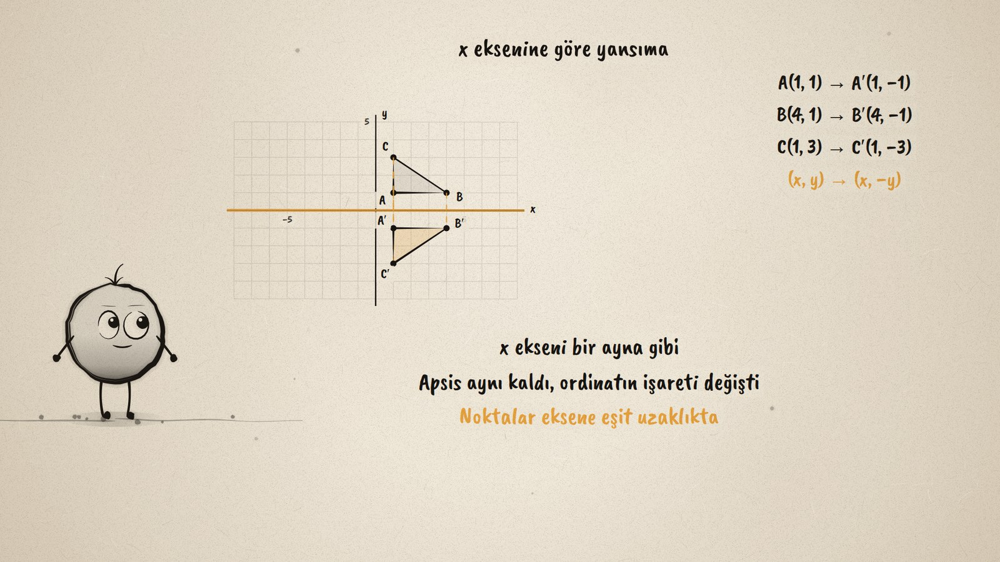
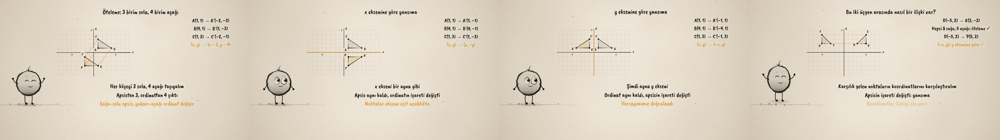

# Koordinatlar Nasıl Değişir? · How Do the Coordinates Change?

**▶ Tarayıcıda izleyin / Watch in the browser:** https://hakanatas.github.io/koordinatlar-degisir/ 
**⬇ MP4 + altyazılar / MP4 + subtitles:** [Releases](https://github.com/hakanatas/koordinatlar-degisir/releases) 
**✎ Kullanılan istem / The prompt behind it:** [PROMPT.md](PROMPT.md) 
**🎞 Bütün filmler / All films:** [Nokta'nın Filmleri](https://hakanatas.github.io/nokta-filmleri/?sinif=8)

> **TR —** 8. sınıf matematik "Dönüşüm" temasındaki MAT.8.5.2 öğrenme çıktısı için hazırlanmış, tamamen JavaScript ile çizilen 92 saniyelik mürekkep animasyonu. Koordinat düzlemindeki A(1, 1), B(4, 1), C(1, 3) üçgeni taşınınca koordinatlar nasıl değişir? Varsayım: öteleme ekler ya da çıkarır, yansıma işaret değiştirir. Üçgen 3 birim sola, 4 birim aşağı ötelenince her noktanın apsisinden 3, ordinatından 4 çıkıyor: (x − 3, y − 4). x eksenine göre yansımada apsis aynı kalıyor, ordinatın işareti değişiyor: (x, −y); y eksenine göre yansımada ise (−x, y). Son olarak bu önermelerle, konumları verilen iki üçgen arasında öteleme mi yoksa yansıma mı olduğu karşılık gelen noktaların koordinatlarından inceleniyor. Altyazılar Türkçe, İngilizce ya da ikisi birlikte seçilebilir.

A 92-second ink animation for **8th-grade maths**. Nokta, the ink character from [The Learning Ink](https://github.com/hakanatas/the-learning-ink), is the guide again. Each image is computed from the original triangle with the rule it illustrates (`T0.map(([x, y]) => [x, -y])` and so on in `scenes/scene1.js`), and the coordinate lines on the right are generated from the same points, so the picture and the arithmetic always agree.

## Learning outcome

MEB, Türkiye Yüzyılı Maarif Modeli, Ortaokul Matematik, 8th grade, "Dönüşüm" theme:

**MAT.8.5.2. Dik koordinat sisteminde geometrik şekillere ait noktaların apsis ve ordinatlarının öteleme dönüşümündeki değişimlerine ve eksenlere göre yansıma dönüşümündeki değişimlerine ilişkin çıkarım yapabilme**
- a) Geometrik şekillere ait noktaların apsis ve ordinatlarının öteleme dönüşümündeki değişimlerine ve eksenlere göre yansıma dönüşümündeki değişimlerine dair varsayımlarda bulunur.
- b) Geometrik şekillerin öteleme dönüşümü altındaki görüntülerini ve koordinat eksenlerine göre yansıma dönüşümü altındaki görüntülerini oluşturur.
- c) Oluşturduğu görüntülere ait noktaların apsis ve ordinatlarını varsayımları ile karşılaştırır.
- ç) Geometrik şekillere ait noktaların apsis ve ordinatlarının öteleme dönüşümündeki değişimlerine ve koordinat eksenlerine göre yansıma dönüşümündeki değişimlerine dair önermeler sunar.
- d) Sundukları önermelerinin dik koordinat sisteminde konumları verilen iki geometrik şekil arasında öteleme veya eksenlere göre yansıma dönüşümüne dayalı bir ilişkinin bulunup bulunmadığını incelemeye sağladığı katkıyı değerlendirir.

## Scenes

| # | Time | Scene | What happens | Outcome |
|---|---|---|---|---|
| 1 | 0–10 s | Üçgen | A guess: a slide adds or subtracts, a mirror changes a sign. | a |
| 2 | 10–28 s | Öteleme | 3 left, 4 down: (x − 3, y − 4). | b, c |
| 3 | 28–46 s | x ekseni | Reflection in the x-axis: (x, −y). | b, c |
| 4 | 46–64 s | y ekseni | Reflection in the y-axis: (−x, y). | b, c, ç |
| 5 | 64–80 s | İlişki | The same shift for every point: a translation; a sign change: a reflection. | d |
| 6 | 80–92 s | Özet | The three rules. | a–d |

## Running it

- **Preview:** double-click `index.html` (it works offline).
- **MP4:** run `npm install` once, then `npm run export -- --format=horizontal --captions=tr`.
- **Subtitles and narration:** `npm run srt` writes `out/captions_*.srt` and `narration_notes.txt`.
- **Editing:**
  - Caption text, timings and narration notes: `captions.js`
  - Everything on screen is drawn by `LI.world(t)` in `scenes/scene1.js` (the plane, the triangles, the arrows, the coordinates, the words); the other scenes only set the camera.
  - Nokta's poses: `src/draw/film.js`; layout for 16:9 and 9:16: `src/draw/kd.js`

It uses the same engine as The Learning Ink: `renderFrame(t)` as a pure function of time, seeded randomness, and frame-by-frame export.
